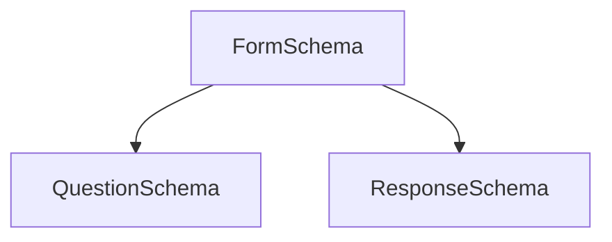

# IECSE Forms

## Installations and setup
- Install MongoDB, Node and npm. 
- To install any package for the `api` or `client`, run `npm i <package-name>` and also `npm i -D @types<package-name>`. The later with save the types of the package as a dev-dependency, which will be handy for typescript. 
- In MongoDB, create a new database called `forms`, and create a new user using `db.createUser({...})`.
- Copy the `.example.env` file and rename it to `.env`, and enter the user details that you just created.
- **Do not edit or remove the .example.env file**  
- Before you start, run `npm install` on both the `api` and `client` folders, to install all the dependencies already setup in `package.json`.
- Install typescript globally - `npm install typescript -g`
- To run the project, run `npm start` in both the `client` and the `api` folders.

## Structure of the Project
- The `client` structure is a blank slate, apart from proxy testing. 
- The structure of the `api` is as follows:
    ```
    /api/src            //Root folder for your code
            /routes
                   /index.ts  //All relevant routes to be stored in this folder, with the index.ts exporting them 
            /models     //Mongoose schemas to be stored here. 
            /config     //Contains the mongoose config file, any other external configs should be stored in this folder
            /index.ts   //The entry point for the project
    ```

## Feature/Implementation List

### Creating Form

- Add questions 
  - Type-in (Paragraph, short, number, email, etc.)
  - Radio Buttons, MCQ
  - MCQ Grid
  - Ranking/Preferential Voting w/ max limit
  - Column Grids
  - Upload file/image
  - Form Schemas (tentative)



```
FormSchema -> FormID, FormName, TimeStamp
QuestionSchema -> FormID, QuestionID, QuestionType, QuestionBody
ResponseSchmea -> FormID, QuestionID, ReponseBody
```


### Viewing Responses

- Admin level access to board members
- Download responses as .csv
- Sort responses
- Filter responses
- RegEx on text fields 

### Misc
- Auto save form state for a limited amount of time - cookies/session stores
- Download response as a user
- Dynamic form themeing (background, colors)