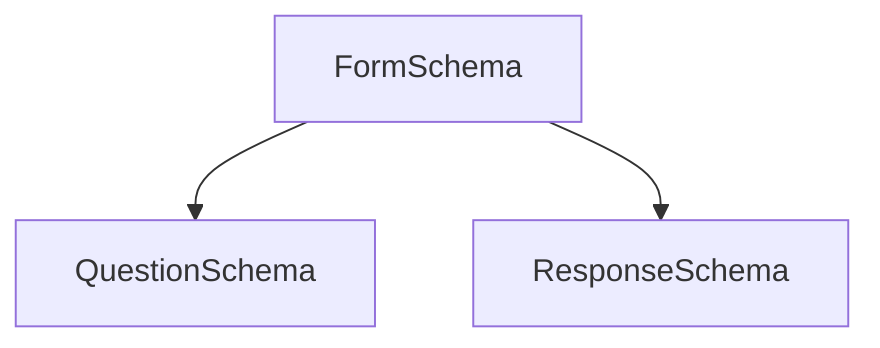

# IECSE Forms

## Features Implemented
<br>Admins can register as "admin"
<br>Board members hardcode as "superadmin"
<br>Toggle REGISTERATION_OPEN=0/1 to block/unblock "/register" (To avoid non-mancom/board using IECSE FORMS)
<br>Login as admin/superadmin from "/login" to open dashboard
<br>Dashboard only for admin/superadmin,User needs to sign-in using google login to fill form

### Features Inside SuperAdmin/Admin DashBoard

- Add/delete/edit are basic functionality of forms.
- Has Many Ques Types which can be used while making form.Ques can be added/updated/deleted even adding ques between existing questions is possible. 
- Form Contains Header,Description,Closing Time at which form can close automatically,also contains a option of Manual close button.
- In case of admin once form is created by admin it can be just seen/edited by owner admin but IECSE FORMS also provide a feature to work in collabration with many admins by sharing ownership using give permit list.All Superadmins by default have view/edit access to all existing forms.  
- Forms can be of three types: 
    - Editable: Forms which can be editted by user after submission,requires google login
    - Non Editable: Forms which can't be editted/opened once submitted,requires google login
    - Anonymous: Forms which keeps the user identity anonymous by not asking for google login to fill and can be filled many number of times as there isnt any record of user
- After Making Form link of a form can be copied using share button which can be sent to users "...../login/formid" this redirects users to google login if form is non anonymous.In anonymous forms login isn't needed.
- IECSE FORMS also provides a feature to admin/superadmin to save exisiting form as template which can be used later.As the name suggests templates are non editable and once created can just be used again or can be deleted.Admins cant delete superadmin templates.Superadmin can create a template from scratch as well as can edit/delete any template exisitng.
- Once User starts giving responses responses count,responses can be viewed in response tab inside form.
- User Responses can even be downloaded as .csv file.
- Users have an option to email a copy of response for future usage.
- Login to dashboard follows all standard checks and email verification to verify user,along with an option to reset password.
- That's it want more? contact Dev Team :)

## Installations and setup
- Install MongoDB, Node and npm. 
- To install any package for the `api` or `client`, run `npm i <package-name>` and also `npm i -D @types<package-name>`. The later with save the types of the package as a dev-dependency, which will be handy for typescript. 
- In MongoDB, create a new database called `forms`, and create a new user using `db.createUser({...})`.
- Copy the `.example.env` file and rename it to `.env`, and enter the user details that you just created.
- **Do not edit or remove the .example.env file**  
- Before you start, run `npm install` on both the `api` and `client` folders, to install all the dependencies already setup in `package.json`.
- Install typescript globally - `npm install typescript -g`
- To run the project, run `npm start` in both the `client` and the `api` folders.

## Structure of the Project
- The `client` structure is a blank slate, apart from proxy testing. 
- The structure of the `api` is as follows:
    ```
    /api/src            //Root folder for your code
            /routes
                   /index.ts  //All relevant routes to be stored in this folder, with the index.ts exporting them 
            /models     //Mongoose schemas to be stored here. 
            /config     //Contains the mongoose config file, any other external configs should be stored in this folder
            /index.ts   //The entry point for the project
    ```

## Required Feature/Implementation List

### Creating Form

- Add questions 
  - Type-in (Paragraph, short, number, email, etc.)
  - Radio Buttons, MCQ
  - MCQ Grid
  - Ranking/Preferential Voting w/ max limit
  - Column Grids
  - Upload file/image
  - Form Schemas (tentative)



```
FormSchema -> FormID, FormName, TimeStamp
QuestionSchema -> FormID, QuestionID, QuestionType, QuestionBody
ResponseSchmea -> FormID, QuestionID, ReponseBody
```


### Viewing Responses

- Admin level access to board members
- Download responses as .csv
- Sort responses
- Filter responses
- RegEx on text fields 

### Misc
- Auto save form state for a limited amount of time - cookies/session stores
- Download response as a user
- Dynamic form themeing (background->dark/light)